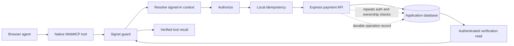

# Using Signet in the Cypress Real World App

This example shows how to add safe, agent-callable WebMCP tools to an existing React and Express application. It uses the Cypress Real World App's normal authentication, payment logic, and database; Signet is added around the consequential browser-side tool execution.

The central example is `send_payment`. A signed-in user can ask a browser agent to send a real payment, while the application:

1. resolves the current user and their allowed accounts;
2. rejects unauthorized input before calling the mutation endpoint;
3. suppresses identical calls made more than once in the same page;
4. executes the normal backend payment operation;
5. reads authoritative state back from the backend and verifies the result; and
6. emits lifecycle events without exposing the payment input or output.

The example also exposes two ordinary read-only tools, `search_payment_users` and `list_payment_accounts`, so an agent can gather the identifiers required by `send_payment`.

## Architecture



Signet and the server deliberately have different responsibilities:

| Layer              | Responsibility                                                                                                                            |
| ------------------ | ----------------------------------------------------------------------------------------------------------------------------------------- |
| Native WebMCP      | Tool registration, discovery, input schema, execution signal, and registration lifecycle                                                  |
| Signet             | Execution ordering, early authorization, local duplicate suppression, postcondition verification, cancellation, and lifecycle observation |
| Application server | Authentication, final authorization, input validation, business logic, and durable idempotency                                            |
| Cypress            | Drives the browser and asserts the resulting UI and database state                                                                        |

Browser-side authorization improves safety and avoids unnecessary mutations, but it is not a security boundary. The Express endpoint always repeats the authorization check.

## Where to start reading

| File                                                                                           | What it demonstrates                                                           |
| ---------------------------------------------------------------------------------------------- | ------------------------------------------------------------------------------ |
| [`src/webmcp/paymentTools.ts`](./src/webmcp/paymentTools.ts)                                   | Tool implementations, `guard(...)`, native registration, and cleanup           |
| [`src/containers/PrivateRoutesContainer.tsx`](./src/containers/PrivateRoutesContainer.tsx)     | Registering tools only for an authenticated React subtree                      |
| [`backend/webmcp-routes.ts`](./backend/webmcp-routes.ts)                                       | Authenticated context, mutation, and authoritative verification endpoints      |
| [`backend/database.ts`](./backend/database.ts)                                                 | Durable operation records and replay/conflict behavior in the fixture database |
| [`cypress/support/webmcp.ts`](./cypress/support/webmcp.ts)                                     | Capture-only WebMCP implementation used by Cypress                             |
| [`cypress/support/reference/paymentTask.ts`](./cypress/support/reference/paymentTask.ts)       | Shared task, seeded identities, and authoritative database oracle              |
| [`cypress/support/reference/paymentDrivers.ts`](./cypress/support/reference/paymentDrivers.ts) | Traditional UI and WebMCP drivers plus comparable measurements                 |
| [`cypress/tests/webmcp/payment-parity.spec.ts`](./cypress/tests/webmcp/payment-parity.spec.ts) | Same task and oracle through both interfaces                                   |
| [`cypress/tests/webmcp/signet-payment.spec.ts`](./cypress/tests/webmcp/signet-payment.spec.ts) | End-to-end safety and state assertions                                         |
| [`scripts/nativeWebMcpSmoke.mjs`](./scripts/nativeWebMcpSmoke.mjs)                             | Opt-in native Chrome discovery, execution, and state smoke test                |

## 1. Start with a normal WebMCP handler

Signet wraps a regular WebMCP-compatible execute function. The underlying payment handler still looks like normal application code:

```ts
const executePayment = async (input: SendPaymentInput, { signal }: { signal: AbortSignal }) => {
  return requestJson<PaymentResponse>("/payments", {
    method: "POST",
    signal,
    body: JSON.stringify(input),
  });
};
```

The native `AbortSignal` is passed to the network request. Signet preserves that signal and checks it between stages.

This repository imports Signet directly from its source tree so the regression suite always tests the current checkout:

```ts
import { guard } from "../../../../src/index";
import { MemoryIdempotencyStore } from "../../../../src/testing";
```

A normal application would import the package instead:

```ts
import { guard } from "@signet/webmcp";
import { MemoryIdempotencyStore } from "@signet/webmcp/testing";
```

`MemoryIdempotencyStore` is appropriate here because this is a test fixture. It is process-local and must not be used as the application's durable exactly-once guarantee.

## 2. Wrap the consequential handler

The payment handler is wrapped once with the application-owned controls it needs:

```ts
const sendPayment = guard(executePayment, {
  name: "send_payment",

  context: (_input, { signal }) => requestJson<PaymentContext>("/context", { signal }),

  authorize: ({ input, context }) => {
    if (input.receiverId === context.userId) {
      return { allowed: false, reason: "A user cannot pay themselves." };
    }

    return context.accounts.some((account) => account.id === input.sourceAccountId)
      ? true
      : { allowed: false, reason: "The source account is not available." };
  },

  idempotency: {
    key: ({ input, context }) => paymentFingerprint(context.userId, input),
    store: idempotencyStore,
  },

  verify: async ({ input, output, context, signal }) => {
    const state = await readPayment(input.operationId, signal);
    return paymentMatches(state, input, output, context);
  },

  observe: recordGuardEvent,
});
```

Each hook has a narrow job.

### Context

`context` calls `GET /webmcp/context`, which reads the existing authenticated session and returns the current user ID plus their usable source accounts. Signet does not create or manage identity.

### Authorization

`authorize` runs before the payment handler. The example rejects self-payment and any source account not present in the signed-in user's context. A denial raises Signet's `AuthorizationError`, and Cypress proves that no `POST /webmcp/payments` request occurs.

### Idempotency

The local key includes the user, operation ID, and normalized payment arguments. Therefore:

- an identical retry shares the same pending or completed result;
- a different payment does not accidentally replay an earlier local result; and
- the different payment reaches the server, where reuse of its durable `operationId` is rejected with `409 Conflict`.

Binding the key to the intended arguments is important. A key containing only `operationId` could silently replay an old result when a caller mistakenly reused that ID with different arguments.

The browser store disappears on reload. The backend therefore keeps its own operation record keyed by user and operation ID. In production, use a transactional database operation and a unique constraint rather than the fixture's JSON database.

### Verification

`verify` does not trust the mutation response alone. It calls the authenticated `GET /webmcp/payments/:operationId` endpoint and checks that authoritative state contains:

- the expected sender and receiver;
- the owned source account;
- the exact amount and description;
- the transaction ID returned by execution; and
- a final status of `complete`.

A mismatch raises Signet's `VerificationError`. Verification reports whether the requested postcondition is observable; it does not roll back a mutation that already happened.

### Observation

`observe` receives lifecycle metadata such as `started`, `authorized`, `executed`, `replayed`, `verified`, `succeeded`, and `failed`. Signet never includes tool inputs or outputs in those events. The example stores sanitized events on `window` solely so Cypress can assert the ordering.

## 3. Register with native WebMCP

Signet is not a tool registry or WebMCP polyfill. The guarded function is assigned directly to the native tool's `execute` property:

```ts
const registration = new AbortController();

await document.modelContext?.registerTool(
  {
    name: "send_payment",
    description: "Send one payment from an account owned by the signed-in user.",
    inputSchema: paymentInputSchema,
    execute: sendPayment,
  },
  { signal: registration.signal }
);
```

The React authenticated route container owns that registration:

```ts
useEffect(() => {
  const registration = registerPaymentTools(showCreatedPayment);
  return () => registration.abort();
}, [showCreatedPayment]);
```

Consequently, the tools appear after login and are removed when the authenticated subtree unmounts during logout. The JSON Schema helps agents call the tool correctly, while the backend still validates every field because browser input is untrusted.

The two read-only discovery tools are registered without `guard(...)`. They have no consequential side effect, and their endpoints already require authentication. Signet is most valuable around mutations and other operations where authorization, replay, or verification matters.

## 4. Repeat the controls on the server

`POST /webmcp/payments` independently:

1. requires the existing authenticated session;
2. validates all payment fields;
3. proves that the source account belongs to the user;
4. rejects self-payment and an unknown recipient;
5. finds or creates the durable operation record; and
6. returns the existing result for an identical retry or `409` for a conflicting retry.

This is intentional defense in depth. An attacker can bypass browser JavaScript, so a Signet authorization hook can never replace server-side authorization.

The authoritative read endpoint is also scoped to the signed-in user. It reads the committed transaction by the user's operation record instead of reflecting the mutation request back to the caller.

## 5. Test the registered tool end to end

Cypress installs a small capture implementation of `document.modelContext` before React loads. It records the exact tools registered by the application and lets the test invoke their real `execute` callbacks. This capture object is test-only; there is no WebMCP shim in the production bundle.

Everything after that capture point is real:

- browser session and cookies;
- React registration lifecycle;
- Signet guard and memory store;
- HTTP requests;
- Express authentication and authorization;
- payment and balance mutations; and
- the JSON database.

The deterministic scenarios prove:

1. tools exist only for a signed-in page;
2. a payment changes both balances, creates a completed transaction, and navigates the UI;
3. an unowned account is denied by Signet before the request and independently denied by the server;
4. concurrent identical calls in one page produce one server mutation;
5. retrying after a reload produces one durable effect; and
6. reusing an operation ID for different arguments returns `409` and still produces one effect;
7. an aborted invocation performs no request;
8. a stale page tool cannot act after its server session expires;
9. a mismatched authoritative read raises a verification failure after the real mutation;
10. a temporary server failure creates no operation record and does not poison a safe retry; and
11. another signed-in user cannot read the first user's authoritative operation.

Cypress checks both the authenticated verification endpoint and the database end state. This avoids a false-positive test where a handler merely returns a plausible success object.

## Run the example

From the Signet repository root:

```sh
npm run test:reference:install
npm run test:reference
```

The first command installs the vendored application's pinned dependencies. The second command builds Signet and the application, starts the React and Express servers, runs only the focused WebMCP Cypress spec, and stops the servers.

No LLM credentials are required. Cypress invokes the registered tools deterministically so failures identify an integration regression rather than model variance.

## Compare the React and WebMCP paths

`payment-parity.spec.ts` treats the user goal as the unit under test: send the same payment from the same seeded sender to the same recipient. The React driver clicks and types through the existing human interface. The WebMCP driver calls the two discovery tools and the guarded mutation tool. Both finish at the same database oracle, which checks:

- the exact sender debit and receiver credit;
- one completed transaction with the expected parties, amount, and description; and
- the expected presence or absence of a WebMCP operation record.

The test writes `cypress/results/reference-comparison.json` with wall time, UI interactions or tool calls, relevant HTTP requests, and mutation requests. Timing from deterministic Cypress drivers is a directional engineering signal, not an LLM benchmark. A publishable agent comparison still needs repeated trials using the same model, prompt, starting state, and authoritative evaluator.

The focused suite explicitly disables Cypress retries and reseeds the database in both `beforeEach` and `afterEach`. To look for order dependence and flaky state leakage, run the suite repeatedly (50 times by default):

```sh
npm run test:reference:repeat

# Short local diagnostic
REFERENCE_REPEAT=5 npm run test:reference:repeat
```

The repeat runner stops on the first failure and writes `cypress/results/reference-repeatability.json`.

## Exercise native Chrome WebMCP

The normal suite injects only the minimum capture object needed for deterministic tests. The separate native lane launches a clean Chrome profile with its WebMCP development features, does not install the capture object, discovers the real registrations with `document.modelContext.getTools()`, executes both discovery tools and `send_payment` with `document.modelContext.executeTool()`, and checks their results, the authenticated authoritative read, and exact database deltas:

```sh
# Report capability without failing when the local Chrome build lacks WebMCP
npm run test:reference:native:probe

# Require the native API and fail if it is unavailable
npm run test:reference:native
```

WebMCP is currently an [experimental Chrome feature](https://developer.chrome.com/docs/ai/webmcp). Local development requires a sufficiently recent Chrome build; production evaluation can use the origin trial. Native execution proves the browser boundary and registration contract. Natural-language tool choice remains a separate probabilistic agent evaluation.

The native lane intentionally does not run inside Cypress. Cypress sets `document.domain` in the application under test, while Chrome disables WebMCP for documents that opt out of origin isolation. A small direct Chrome DevTools Protocol harness keeps a real `http://localhost` origin and avoids that test-runner distortion.

The native lane also caught a real compatibility issue hidden by the capture harness: the tested Chrome 151 build omitted the tool callback's execution-options argument, although the current `webmcp-types` package declares it as required. The registration adapter now forwards `options.signal` when the host supplies it and creates a non-aborted fallback signal otherwise. No Signet core code needed to change.

The upstream application currently requires Node 22 or 24 because a legacy JWT dependency is incompatible with Node 26. These repository commands select an isolated Node 24 runtime through `npx`.

## Applying the pattern to another application

For each consequential tool:

1. Keep the core execute function a normal, abortable application operation.
2. Resolve identity and resource capabilities through `context`.
3. Authorize before execution using that application-owned context.
4. Bind the local idempotency key to both the principal and normalized intent.
5. Enforce authentication, authorization, validation, and durable idempotency again on the server.
6. Verify through an independent authoritative read when a successful response alone is insufficient.
7. Register through `document.modelContext` and unregister with the page's authentication lifecycle.
8. Observe metadata, not sensitive tool arguments or results.
9. Test denial, replay, conflicting retry, and database postconditions—not only the happy-path return value.

For the smaller standalone API example, see Signet's [native WebMCP example](../../examples/native-webmcp.ts). For production guidance, see the [production checklist](../../docs/production-checklist.md).

## Scope and provenance

This directory vendors the [Cypress Real World App](https://github.com/cypress-io/cypress-realworld-app) at commit `28ca4d03e4c68d366ccdbb25d43e1f37b3c67a4d` (2026-08-13). Its MIT license is retained in [`LICENSE`](./LICENSE). Upstream CI and editor configuration were omitted because this copy is an in-repository integration fixture.

The fixture database is synchronous in one Node process. It is suitable for deterministic regression tests, not as a production model for transaction isolation, crash recovery, or concurrent idempotency.
